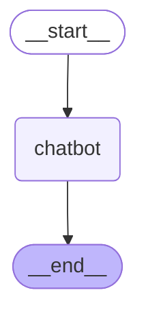
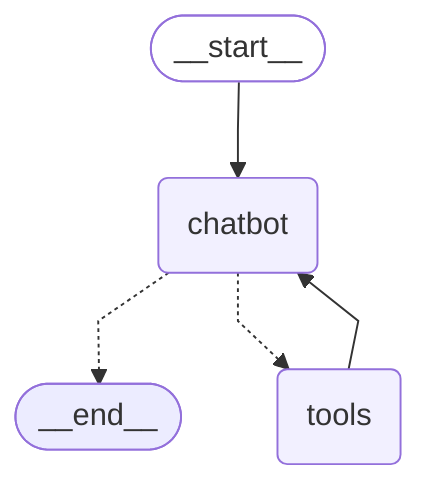
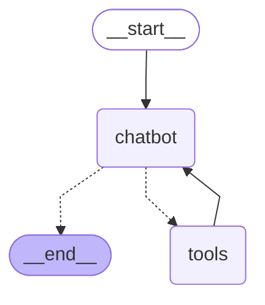

<div className="text-center">
  
  <p>LangGraph（Photo by <a href="https://unsplash.com/@writecodenow?utm_content=creditCopyText&utm_medium=referral&utm_source=unsplash">Boitumelo</a> on <a href="https://unsplash.com/photos/a-computer-monitor-sitting-on-top-of-a-desk-v7xiSfj6mGI?utm_content=creditCopyText&utm_medium=referral&utm_source=unsplash">Unsplash</a>)
）</p>
</div>

## 目录
<TOCInline toc={props.toc} exclude="概述" toHeading={3} />

## 1. LangGraph介绍

LangGraph是由LangChain团队开发的前沿开源框架，它代表了AI应用架构的重要进步，专为构建、部署和管理复杂的生成式AI工作流而设计。作为一个强大的编排工具，它提供了底层基础设施，用于支持长时间运行、有状态的工作流或智能体（agent）系统，为开发者提供了构建下一代AI应用的关键能力。

> LangGraph is a low-level orchestration framework for building, managing, and deploying long-running, stateful agents.

在当今AI应用开发的浪潮中，简单的问答式交互已无法满足复杂应用场景的需求。企业和开发者正在寻求构建更加智能、持久且具有上下文感知能力的系统。从基础的聊天机器人到复杂的多智能体系统，开发者需要一种能够有效管理状态、协调多个组件之间交互的框架。LangGraph正是为解决这一挑战而生，它通过状态机的概念，使开发者能够构建具有持久状态和复杂逻辑流的LLM应用，从而实现真正的"智能"交互体验。

### 1.1 什么是LangGraph？

LangGraph是一个优雅而强大的Python库，它使用图结构来建模和管理AI工作流中各组件之间的复杂关系。与其他框架不同，LangGraph不抽象化提示（prompt）或架构，而是专注于提供底层支持基础设施，赋予开发者最大的灵活性和控制力。它的设计理念源于计算机科学中的状态机概念，但针对LLM应用场景进行了专门优化。

LangGraph的核心理念是将应用逻辑表示为一个图（Graph），其中：

- **节点（Nodes）**：代表工作流中的独立组件或智能体，可以视为以特定方式相互交互的"参与者"。每个节点可以执行特定的功能，如生成文本、分析数据或调用外部工具。
- **边（Edges）**：是Python中的函数，基于当前状态决定下一个要执行的节点，实现了工作流中的条件逻辑和控制流。
- **状态（State）**：作为一种"记忆库"，记录和跟踪AI系统处理的所有有价值的信息，确保系统能够维持上下文并做出连贯的响应。

这种设计使得开发者可以：
- 构建具有清晰定义的状态转换逻辑的应用，使复杂的AI行为变得可预测和可控
- 实现复杂的条件分支和循环，使AI能够根据不同情况做出不同反应
- 维护和恢复应用状态，即使在系统重启或故障后也能继续之前的对话
- 设计多智能体协作系统，让多个专业化的AI组件协同工作，解决复杂问题

### 1.2 LangGraph的核心优势

LangGraph提供了以下关键优势，使其成为构建复杂AI工作流的理想选择：

- **持久执行（Durable Execution）** - 构建能够在故障中持续运行的智能体，可以自动从中断点精确恢复，确保长时间运行的任务不会因临时问题而失败
- **人机协作（Human-in-the-loop）** - 无缝整合人类监督，允许在执行过程中的任何点检查和修改智能体状态，实现人类智慧与AI能力的最佳结合
- **全面记忆管理（Comprehensive Memory）** - 创建真正有状态的智能体，同时具备短期工作记忆和跨会话的长期持久记忆，使AI能够提供个性化和上下文相关的体验
- **调试能力（Debugging）** - 通过LangSmith提供的可视化工具深入了解复杂的智能体行为，追踪执行路径和状态转换，大大简化了开发和故障排除过程
- **生产级部署（Production-ready Deployment）** - 使用专为处理有状态、长时间运行的工作流而设计的可扩展基础设施，确保在实际应用中的可靠性和性能
- **工具集成** - 无缝集成各种外部工具和API，扩展LLM的能力边界，使AI能够执行实际操作并访问最新信息
- **多智能体支持** - 内置支持多智能体系统的构建，使多个LLM实例能够协同工作，分工合作解决复杂问题

### 1.3 LangGraph的关键组件

LangGraph框架围绕几个关键组件构建，这些组件协同工作，使用户能够创建和管理复杂的AI工作流：

#### 图架构组件
- **状态图（Stateful Graphs）**：每个节点代表计算中的一步，本质上设计一个状态图。这种有状态的方法允许图保留关于先前步骤的信息，随着计算的展开实现信息的连续和上下文处理。
- **循环图（Cyclical Graph）**：包含至少一个循环的图，对智能体运行时至关重要。这意味着存在一条路径，从同一节点开始和结束，在图中形成一个循环。
- **节点（Nodes）**：在LangGraph中，节点代表AI工作流中的独立组件或智能体。例如，可以使用ToolNode添加用于工具调用的节点。
- **边（Edges）**：边是Python中的函数，基于当前状态确定下一个要执行的节点。边可以是条件分支或固定转换。

#### 监控机制
- **人机协作（Human-in-the-loop）**：指在过程中某个点需要人类交互的要求。在机器学习领域，人机协作指的是人类增强机器计算能力以做出明智决策的协作过程。

#### 工具和集成
- **RAG（检索增强生成）**：将LLM的能力与外部来源的上下文信息相结合，通过检索相关文档，然后将其用作答案生成的输入。
- **工作流（Workflows）**：定义AI工作流的节点交互序列。通过将节点排列成工作流，用户可以创建更复杂和动态的工作流。
- **APIs**：LangGraph提供了一组API，使用户能够以编程方式与LangGraph的组件交互。
- **LangSmith**：LangSmith是一个专门用于在LangGraph中构建和管理LLM的API，提供了初始化LLM、添加条件边和优化性能的工具。

通过这些组件的创新组合，用户可以构建更复杂的AI工作流，充分利用各个组件的优势。

### 1.4 LangGraph与其他框架的对比

在AI智能体框架领域，LangGraph、CrewAI和OpenAI Swarm是三个主要的竞争者，每个框架都有其独特的优势和适用场景。本节将对这三个框架进行对比分析，帮助开发者选择最适合自己项目需求的框架。

#### LangGraph的特点

LangGraph是一个基于图结构的AI系统，主要针对涉及结构化工作流的任务，特别是自然语言处理（NLP）领域。其图驱动的架构使其在需要上下文连贯性的应用中表现尤为出色。

**优势：**
1. **任务依赖可视化**：LangGraph的图驱动架构允许用户清晰地映射和理解任务组件之间的交互和依赖关系，对于聊天机器人设计或虚拟助手开发等领域尤为重要。
2. **可扩展架构**：模块化设计使其能与各种工具和框架无缝集成，支持从NLP到基础数据分析的广泛应用。
3. **改进的任务管理**：通过可视化任务依赖和工作流，提供了一种组织化的任务管理方法，有助于团队有效管理复杂流程。
4. **增强的协作功能**：工作流的可视化表示促进了团队之间的更好协作，开发人员、数据科学家和领域专家可以轻松交流AI流程背后的逻辑。
5. **自动错误检测**：工作流的可视化表示有助于快速识别任务执行中的错误或漏洞，使故障排除变得更加直观。

**挑战：**
1. **学习曲线陡峭**：对于不熟悉基于图的模型的用户，掌握LangGraph可能比较耗时。
2. **中等可扩展性**：虽然LangGraph有效处理NLP密集型任务，但其架构在需要大规模智能体协作的系统中可能无法高效扩展。
3. **高级AI功能有限**：对于涉及机器学习模型训练、强化学习或实时数据处理的复杂任务，LangGraph的能力可能有限。
4. **配置复杂**：对于不熟悉该平台的用户，配置LangGraph的工作流可能是一项艰巨的任务。

#### CrewAI的特点

CrewAI强调易用性和协作，是需要AI智能体与人类操作员密切互动环境的突出选择。其设计理念围绕着为非技术用户简化复杂操作，同时增强多智能体协作。

**优势：**
1. **对非技术用户的直观设计**：拖放界面和预构建模板使其非常用户友好，降低了非技术团队的采用门槛。
2. **注重人机协同**：优化了需要人类操作员和AI智能体无缝协作的工作流，适用于客户支持或应急响应系统等场景。
3. **实时监控和控制**：提供强大的工具来实时监控AI智能体性能，允许人类操作员在必要时进行干预。
4. **多智能体系统的可扩展性**：专为管理多智能体环境而构建，适用于大型操作的扩展。
5. **可定制模板**：提供可轻松适应特定业务需求的可定制模板，适合具有独特操作要求的组织。

**挑战：**
1. **对高度技术应用的适用性有限**：其简单性意味着它可能不足以应对复杂的技术工作流，如检索增强生成（RAG）或需要深度技术集成的数据处理。
2. **协作优先于计算效率**：对协作和易用性的强调有时可能以牺牲计算效率为代价。
3. **高级协作功能的学习曲线**：尽管CrewAI用户友好，但不熟悉多智能体系统的团队可能需要额外培训才能有效利用其高级协作功能。
4. **大型部署资源密集**：对于扩展操作以包含数百或数千个智能体的组织，CrewAI可能需要大量计算资源和人力监督。

#### OpenAI Swarm的特点

OpenAI Swarm专为大规模、计算密集型任务而设计。其架构支持检索密集型工作流和实时处理，是需要强大数据处理能力行业的有力工具。

**优势：**
1. **对检索型工作流的强力支持**：在知识检索、数据集成和实时分析至关重要的场景中表现出色。
2. **与开源工具的无缝集成**：与Chroma和LangChain等开源工具的兼容性增强了其实用性。
3. **实时分析和处理**：支持高性能数据分析，适用于需要快速决策或实时数据处理的应用。
4. **高性能计算能力**：能够处理极高的计算工作负载，使其能够有效扩展用于大型、数据密集型应用。
5. **先进的AI模型支持**：为强化学习、监督学习和深度学习网络等高级机器学习模型提供强大支持。

**挑战：**
1. **手动配置要求**：通常需要广泛的手动设置才能达到最佳性能，特别是对于专业用例。
2. **高计算需求**：虽然OpenAI Swarm的高级功能令人印象深刻，但它们伴随着高昂的计算成本。
3. **与遗留系统集成的复杂性**：其高级功能在与较旧或较不灵活的遗留系统协作时可能会带来集成挑战。
4. **对较小应用可能过度**：对于不需要复杂、数据密集型处理的小规模应用，OpenAI Swarm的高级功能可能过于强大。
5. **持续维护要求**：考虑到Swarm的高级功能和计算需求，可能需要持续维护和微调以保持系统顺利运行。

#### 框架选择指南

选择合适的AI智能体框架取决于您的具体业务需求：

- **选择LangGraph**：如果您的项目围绕创建或分析文本，LangGraph是完美选择。其强大的自然语言处理（NLP）能力，结合基于图的架构，确保了上下文数据流的无缝衔接。LangGraph在聊天机器人、虚拟助手等应用中表现出色，特别适合需要维持连贯对话的场景。

- **选择CrewAI**：如果您的业务专注于自动化团队任务和改进协作，CrewAI是理想选择。其多智能体协作模型有助于简化通信和任务委派，非常适合智能工厂、协调物流和团队驱动项目等行业。

- **选择OpenAI Swarm**：如果您的业务处理大型数据集并需要能够通过协作解决复杂问题的AI系统，OpenAI Swarm是最佳选择。它对金融或医疗保健等行业特别有效，这些行业需要复杂的数据处理和复杂的决策制定。凭借其可扩展性和与GPT等高级模型的集成，OpenAI Swarm可以支持实时监控或金融建模等大规模应用。

总结来说：
- 如果需要强大的文本分析和NLP功能，选择LangGraph。
- 如果想要自动化团队任务并改进协作，选择CrewAI。
- 如果处理复杂数据并需要可扩展解决方案，选择OpenAI Swarm。

每个框架都提供独特的优势，因此请选择与您特定业务需求相符的框架。

#### 功能对比表

下表提供了三个框架在关键特性上的对比：

| 特性 | LangGraph | CrewAI | OpenAI Swarm |
|------|-----------|--------|---------------|
| 可扩展性 | 中等 | 高 | 非常高 |
| 协作支持 | 有限 | 广泛 | 中等 |
| API集成 | 优秀 | 良好 | 优秀 |
| 学习模型 | 专注NLP | 通用型 | 高级 |
| 部署平台 | 云端和本地 | 多平台 | 云端优化 |

这个对比表可以帮助您快速了解每个框架的优势领域，从而根据项目需求做出更明智的选择。

## 2. 构建基础聊天机器人

在本节中，我们将使用LangGraph构建一个基础的聊天机器人，并集成DeepSeek大模型作为对话引擎。虽然这是一个简单的示例，但它将展示LangGraph的核心概念和工作流程，为后续构建更复杂的应用奠定基础。

### 2.1 环境准备

在开始之前，我们需要使用uv工具安装必要的依赖（uv是一个现代化的Python包管理工具，具有更快的安装速度和更好的依赖解析）：

```bash
# 使用uv安装LangGraph和相关依赖
uv pip install -U langgraph langchain python-dotenv typing-extensions
```

接下来，我们需要创建一个`.env`文件来存储API密钥。在项目根目录创建该文件：

```bash
# .env文件内容
DEEPSEEK_API_KEY=your_deepseek_api_key_here
```

### 2.2 实现基础聊天机器人

现在，让我们开始实现一个基础的聊天机器人。创建一个名为`1-build-basic-chatbot.py`的文件，并添加以下代码：

```python
from typing import Annotated

from langchain.chat_models import init_chat_model
from typing_extensions import TypedDict

from langgraph.graph import StateGraph, START
from langgraph.graph.message import add_messages

import os
from dotenv import load_dotenv

# 加载.env文件中的环境变量
load_dotenv()

class State(TypedDict):
    messages: Annotated[list, add_messages]


graph_builder = StateGraph(State)


llm = init_chat_model(
    "deepseek-chat",  # 使用DeepSeek模型
    api_key=os.environ.get("DEEPSEEK_API_KEY")
)


def chatbot(state: State):
    return {"messages": [llm.invoke(state["messages"])]}


# 添加节点和边
graph_builder.add_node("chatbot", chatbot)
graph_builder.add_edge(START, "chatbot")
graph = graph_builder.compile()

def stream_graph_updates(user_input: str):
    for event in graph.stream({"messages": [{"role": "user", "content": user_input}]}):
        for value in event.values():
            print("Assistant:", value["messages"][-1].content)


while True:
    try:
        user_input = input("User: ")
        if user_input.lower() in ["quit", "exit", "q"]:
            print("Goodbye!")
            break
        stream_graph_updates(user_input)
    except KeyboardInterrupt:
        print("\nGoodbye!")
        break
```

### 2.3 代码解析

让我们逐步分析这个简单聊天机器人的实现：

#### 导入必要的库

```python
from typing import Annotated
from langchain.chat_models import init_chat_model
from typing_extensions import TypedDict
from langgraph.graph import StateGraph, START
from langgraph.graph.message import add_messages
import os
from dotenv import load_dotenv
```

这里我们导入了必要的库，包括：
- `typing` 和 `typing_extensions` 用于类型注释
- `langchain.chat_models` 用于初始化聊天模型
- `langgraph.graph` 提供了构建状态图的核心组件
- `os` 和 `dotenv` 用于环境变量管理

#### 加载环境变量

```python
load_dotenv()
```

这行代码会从项目根目录的 `.env` 文件中加载环境变量，包括我们的 `DEEPSEEK_API_KEY`。

#### 定义状态

```python
class State(TypedDict):
    messages: Annotated[list, add_messages]
```

这里我们定义了一个 `State` 类，它是我们图中的状态表示。在这个简单的例子中，状态只包含一个 `messages` 字段，用于存储对话消息。我们使用 `add_messages` 注解来指定这是一个消息列表，并且LangGraph应该使用消息添加的方式来处理它。

#### 创建图构建器

```python
graph_builder = StateGraph(State)
```

这行创建了一个状态图构建器，它将使用我们定义的 `State` 类型。

#### 初始化模型

```python
llm = init_chat_model(
    "deepseek-chat",  # 使用DeepSeek模型
    api_key=os.environ.get("DEEPSEEK_API_KEY")
)
```

这里我们初始化了DeepSeek的聊天模型，直接从环境变量中获取API密钥。

#### 定义节点函数

```python
def chatbot(state: State):
    return {"messages": [llm.invoke(state["messages"])]}
```

这个函数定义了聊天机器人节点的行为。它接收当前状态（包含消息历史），将其传递给LLM模型，然后返回模型的响应作为新消息。

#### 构建图

```python
graph_builder.add_node("chatbot", chatbot)
graph_builder.add_edge(START, "chatbot")
graph = graph_builder.compile()
```

这里我们：
1. 添加了一个名为 "chatbot" 的节点，并将我们的 `chatbot` 函数与其关联
2. 添加了一条从 `START`（这是LangGraph的一个特殊常量）到 "chatbot" 节点的边
3. 编译图以生成可执行的图实例

#### 实现流式响应

```python
def stream_graph_updates(user_input: str):
    for event in graph.stream({"messages": [{"role": "user", "content": user_input}]}):
        for value in event.values():
            print("Assistant:", value["messages"][-1].content)
```

这个函数实现了流式响应处理。它：
1. 创建一个初始状态，其中包含用户输入作为消息
2. 调用图的 `stream` 方法来流式处理图的执行
3. 对于每个事件，打印出助手的响应

#### 主循环

```python
while True:
    try:
        user_input = input("User: ")
        if user_input.lower() in ["quit", "exit", "q"]:
            print("Goodbye!")
            break
        stream_graph_updates(user_input)
    except KeyboardInterrupt:
        print("\nGoodbye!")
        break
```

最后，我们实现了一个简单的命令行界面，允许用户与聊天机器人进行交互。用户可以输入消息，程序会调用我们的 `stream_graph_updates` 函数来处理响应。用户也可以通过输入 "quit"、"exit" 或 "q" 来退出程序。

### 2.4 运行聊天机器人

现在我们可以运行这个简单的聊天机器人了。确保你已经在`.env`文件中设置了有效的DeepSeek API密钥，然后运行：

```bash
uv run 1-build-basic-chatbot.py
```

你将看到一个交互式的命令行界面，可以开始与聊天机器人对话：

```
User: who are you?
Assistant: I’m DeepSeek Chat, your AI assistant created by **DeepSeek**! 🤖✨ I’m here to help answer your questions, provide insights, and assist with anything from general knowledge to coding, writing, and more.

Think of me as a friendly, knowledgeable companion—always ready to chat, research, or brainstorm with you! 💡

What can I help you with today? 😊

User: exit
Goodbye!
```

上诉代码执行 while True 前添加流程图打印 

```Python
print(graph.get_graph().draw_mermaid())
```

输出结果如下：




## 3. 添加工具使用能力

在上一节中，我们构建了一个基础的聊天机器人，它可以回答用户的问题，但仅限于模型训练数据中包含的知识。在这一节中，我们将通过添加工具使用能力来增强我们的聊天机器人，使其能够访问外部信息源，回答更广泛的问题。

### 3.1 环境准备

在开始之前，我们需要安装额外的依赖项。我们将使用Tavily搜索API作为我们的外部知识源，它允许我们的聊天机器人在网络上搜索信息。

```bash
uv pip install -U langchain-tavily httpx
```

你还需要获取一个Tavily API密钥，可以从[Tavily官网](https://tavily.com/)注册获取。获取API密钥后，将其添加到你的`.env`文件中：

```
DEEPSEEK_API_KEY=your_deepseek_api_key
TAVILY_API_KEY=your_tavily_api_key
```

### 3.2 使用工具增强聊天机器人

现在，让我们创建一个名为`2-add-tools.py`的文件，实现一个具有工具使用能力的聊天机器人：

```python
from typing import Annotated

from langchain.chat_models import init_chat_model
from langchain_tavily import TavilySearch
from langchain_core.messages import BaseMessage
from typing_extensions import TypedDict

from langgraph.graph import StateGraph
from langgraph.graph.message import add_messages
from langgraph.prebuilt import ToolNode, tools_condition

import os
from dotenv import load_dotenv

# 加载.env文件中的环境变量
load_dotenv()

class State(TypedDict):
    messages: Annotated[list, add_messages]


graph_builder = StateGraph(State)

llm = init_chat_model(
    "deepseek-chat",  # 使用DeepSeek模型
    api_key=os.environ.get("DEEPSEEK_API_KEY")
)

# 初始化Tavily搜索工具
tool = TavilySearch(max_results=2)
tools = [tool]

# 将工具绑定到LLM
llm_with_tools = llm.bind_tools(tools)

def chatbot(state: State):
    return {"messages": [llm_with_tools.invoke(state["messages"])]}

# 添加聊天机器人节点
graph_builder.add_node("chatbot", chatbot)

# 添加工具节点
tool_node = ToolNode(tools=[tool])
graph_builder.add_node("tools", tool_node)

# 添加条件边
graph_builder.add_conditional_edges(
    "chatbot",
    tools_condition,
)
# 工具调用完成后，返回到聊天机器人节点
graph_builder.add_edge("tools", "chatbot")
graph_builder.set_entry_point("chatbot")
graph = graph_builder.compile()

# 打印图结构
print(graph.get_graph().draw_mermaid())

def stream_graph_updates(user_input: str):
    for event in graph.stream({"messages": [{"role": "user", "content": user_input}]}):
        for value in event.values():
            print("Assistant:", value["messages"][-1].content)

while True:
    try:
        user_input = input("User: ")
        if user_input.lower() in ["quit", "exit", "q"]:
            print("Goodbye!")
            break
        stream_graph_updates(user_input)
    except KeyboardInterrupt:
        print("\nGoodbye!")
        break
```

### 3.3 代码解析

让我们详细分析这个增强版聊天机器人的实现：

#### 导入新的依赖项

```python
from langchain_tavily import TavilySearch
from langgraph.prebuilt import ToolNode, tools_condition
```

与基础版本相比，我们添加了两个关键导入：
- `TavilySearch`：Tavily的搜索API客户端
- `ToolNode` 和 `tools_condition`：LangGraph提供的预构建组件，用于处理工具调用

#### 初始化搜索工具

```python
tool = TavilySearch(max_results=2)
tools = [tool]
```

这里我们创建了一个Tavily搜索工具实例，并将其放入工具列表中。`max_results=2`参数指定每次搜索最多返回2个结果。

#### 绑定工具到LLM

```python
llm_with_tools = llm.bind_tools(tools)
```

`bind_tools`方法将工具列表绑定到LLM，使模型知道它可以使用这些工具，并了解如何正确格式化工具调用。

#### 添加工具节点

```python
tool_node = ToolNode(tools=[tool])
graph_builder.add_node("tools", tool_node)
```

这里我们创建了一个`ToolNode`实例，它是LangGraph提供的预构建节点，专门用于处理工具调用。我们将Tavily搜索工具传递给它，并将其添加到图中作为"tools"节点。

#### 添加条件边

```python
graph_builder.add_conditional_edges(
    "chatbot",
    tools_condition,
)
```

这是最关键的部分。我们使用`add_conditional_edges`方法添加条件边，它决定了图的执行流程。`tools_condition`是一个预构建的条件函数，它检查聊天机器人的输出是否包含工具调用：
- 如果包含工具调用，流程将转向"tools"节点
- 如果不包含工具调用，流程将结束

#### 完成图的构建

```python
graph_builder.add_edge("tools", "chatbot")
graph_builder.set_entry_point("chatbot")
graph = graph_builder.compile()
```

我们添加了一条从"tools"节点回到"chatbot"节点的边，这样在工具执行完毕后，控制流会回到聊天机器人，让它处理工具返回的结果。然后我们设置入口点为"chatbot"节点，并编译图。

#### 可视化图结构

```python
print(graph.get_graph().draw_mermaid())
```

这行代码会打印出图的Mermaid格式表示，帮助我们理解图的结构。

### 3.4 运行聊天机器人

现在我们可以运行这个增强版的聊天机器人了：

```bash
uv run 2-add-tools.py
```

运行后，你会首先看到图的结构表示：



从图中可以看到，我们的聊天机器人现在有了一个循环流程：
1. 用户输入传递给聊天机器人节点
2. 如果聊天机器人决定使用工具，控制流转向工具节点
3. 工具执行完毕后，结果返回给聊天机器人
4. 聊天机器人处理工具结果并生成最终响应

下面是一个示例交互：

```
User: 什么是LangGraph的核心组件？

Assistant:
Assistant: {"query": "LangGraph 核心组件", "follow_up_questions": null, "answer": null, "images": [], "results": [{"url": "https://cloud.tencent.com/developer/news/2180955", "title": "Agent快速构建框架的langGraph到底是什么及案例 - 腾讯云", "content": "LangGraph是一个使用 LLM 构建有状态、多参与者应用程序的库，用于创建代理和多代理工作流。请在此处查看入门教程。\n\nLangGraph 的灵感来自Pregel和Apache Beam。公共接口灵感来自NetworkX。LangGraph 由 LangChain 的创建者 LangChain Inc 构建，但可以在没有 LangChain 的情况下使用。\n\nLangGraph核心组件\n\nLangGraph的核心组件包括Graphs、State、Nodes、Edges、Send、Checkpointer。LangGraph有哪些优点：可控性、持久性、Human-in-the-loop、ReactAgent。\n\nstate\n\nfrom langgraph.graph import StateGraph\n\nfrom typing import TypedDict, List, Annotated\n\nimport Operator\n\nclass State(TypedDict):\n\n  input: str", "score": 0.9403148, "raw_content": null}, {"url": "https://blog.csdn.net/TaloyerG/article/details/142546057", "title": "Langgraph 的Planning Agent 深度解析原创 - CSDN博客", "content": "Langgraph 的核心组件包括语言理解模块、知识库和规划模块。 1.2.1 语言理解模块. 语言理解模块负责解析用户的自然语言输入，将其转化为可供计算机处理的", "score": 0.9348309, "raw_content": null}], "response_time": 1.87}
Assistant: LangGraph的核心组件主要包括以下几个方面：

1. **Graphs（图）**：用于构建和管理工作流的结构。
2. **State（状态）**：用于跟踪和管理应用程序的状态。
3. **Nodes（节点）**：表示工作流中的单个步骤或操作。
4. **Edges（边）**：定义节点之间的关系和流程控制。
5. **Send（发送）**：用于在节点之间传递数据或消息。
6. **Checkpointer（检查点）**：用于持久化和恢复工作流的状态。

此外，LangGraph还支持可控性、持久性、Human-in-the-loop（人工干预）和ReactAgent（反应式代理）等功能特性。

这些组件共同构成了LangGraph的基础，使其能够高效地构建和管理有状态的多参与者应用程序或代理工作流。

User: exit
Goodbye!
```

### 3.5 小结

在这一节中，我们成功地增强了聊天机器人，使其具备了使用外部工具的能力。通过集成Tavily搜索API，我们的聊天机器人现在可以：

1. 识别需要外部信息的问题
2. 自动调用搜索工具获取相关信息
3. 处理搜索结果并生成基于这些信息的回答

这种增强极大地扩展了聊天机器人的能力范围，使其不再局限于模型的训练数据。

我们还学习了LangGraph的几个重要概念：

1. 工具绑定（Tool Binding）：通过`bind_tools`方法将工具与LLM集成
2. 预构建组件：使用`ToolNode`和`tools_condition`简化工具处理
3. 条件边：根据状态动态决定执行流程
4. 循环流程：创建包含循环的复杂工作流

在下一节中，我们将进一步增强聊天机器人，添加记忆功能，使其能够记住对话历史并提供更连贯的回答。

## 4. 添加记忆功能

在上一节中，我们为聊天机器人添加了使用外部工具的能力。然而，我们的聊天机器人仍然存在一个重要的限制：它不记得之前的对话内容。每次新的交互都是从零开始的，这使得进行连贯的多轮对话变得困难。

在这一节中，我们将通过添加记忆功能来解决这个问题，使聊天机器人能够记住用户之前说过的话，并在后续对话中引用这些信息。

### 4.1 环境准备

对于这一部分，我们不需要额外的依赖项，因为LangGraph已经内置了记忆功能。我们将使用`langgraph.checkpoint.memory`模块中的`MemorySaver`类来实现记忆功能。

### 4.2 使用记忆增强聊天机器人

让我们创建一个名为`3-add-memory.py`的文件，实现一个具有记忆功能的聊天机器人：

```python
"""LangGraph 教程: 添加记忆功能的聊天机器人

本示例展示了如何使用 LangGraph 的检查点功能为聊天机器人添加记忆功能，
使其能够记住对话历史并在多轮对话中保持上下文。
"""

from typing import Annotated

from langchain.chat_models import init_chat_model
from langchain_tavily import TavilySearch
from langchain_core.messages import BaseMessage
from typing_extensions import TypedDict

# 导入 MemorySaver 用于实现记忆功能
from langgraph.checkpoint.memory import MemorySaver
from langgraph.graph import StateGraph
from langgraph.graph.message import add_messages
from langgraph.prebuilt import ToolNode, tools_condition

import os
from dotenv import load_dotenv

# 加载.env文件中的环境变量
load_dotenv()

# 定义状态类型，使用 add_messages 注解来自动合并消息列表
class State(TypedDict):
    messages: Annotated[list, add_messages]  # 消息列表将使用 add_messages reducer 自动合并


# 初始化 DeepSeek 聊天模型
llm = init_chat_model(
    "deepseek-chat",  # 使用DeepSeek模型
    api_key=os.environ.get("DEEPSEEK_API_KEY")  # 从环境变量中获取API密钥
)

# 创建状态图构建器
graph_builder = StateGraph(State)

# 初始化Tavily搜索工具
print("\n初始化Tavily搜索工具...")
tool = TavilySearch(max_results=2)  # 设置最多返回2个搜索结果
tools = [tool]

# 将工具绑定到LLM
llm_with_tools = llm.bind_tools(tools)

# 定义聊天机器人节点函数
def chatbot(state: State):
    """LLM节点函数，处理用户输入并生成响应"""
    return {"messages": [llm_with_tools.invoke(state["messages"])]}

# 添加聊天机器人节点
graph_builder.add_node("chatbot", chatbot)

# 添加工具节点
tool_node = ToolNode(tools=[tool])
graph_builder.add_node("tools", tool_node)

# 添加条件边
graph_builder.add_conditional_edges(
    "chatbot",
    tools_condition,
)
# 工具调用完成后，返回到聊天机器人节点
graph_builder.add_edge("tools", "chatbot")
graph_builder.set_entry_point("chatbot")

print("\n构建图并添加记忆功能...")

# 创建内存保存器
print("\n创建 MemorySaver 实例作为检查点保存器...")
memory = MemorySaver()  # 在内存中保存状态，适用于开发和测试

# 使用内存保存器编译图
print("使用检查点保存器编译图...")
graph = graph_builder.compile(checkpointer=memory)  # 将内存保存器传递给图

# 打印图结构
print("\n图结构如下：")
print(graph.get_graph().draw_mermaid())

# 定义对话线程ID
print("\n设置对话线程 ID = '1'...")
config = {"configurable": {"thread_id": "1"}}  # 使用线程ID来标识和区分不同的对话

# 示例 1: 第一次对话
print("\n示例 1: 第一次对话 - 用户介绍自己")
user_input = "Hi there! My name is Will."
print(f"\n用户输入: '{user_input}'")

# 注意: config 是 stream() 函数的第二个参数!
print("使用线程 ID '1' 调用图...")
events = graph.stream(
    {"messages": [{"role": "user", "content": user_input}]},
    config,  # 传递包含 thread_id 的配置
    stream_mode="values",
)

print("\n助理回应:")
for event in events:
    event["messages"][-1].pretty_print()  # 打印助理的回应

# 示例 2: 测试记忆功能
print("\n\n示例 2: 第二次对话 - 测试记忆功能")
user_input = "Remember my name?"
print(f"\n用户输入: '{user_input}'")

# 使用相同的线程ID再次调用图
print("使用相同的线程 ID '1' 再次调用图...")
events = graph.stream(
    {"messages": [{"role": "user", "content": user_input}]},
    config,  # 使用相同的配置，图将加载之前保存的状态
    stream_mode="values",
)

print("\n助理回应 (应该记得用户名字):")
for event in events:
    event["messages"][-1].pretty_print()

# 示例 3: 新对话线程
print("\n\n示例 3: 新对话线程 - 测试线程隔离")
print("创建新的线程 ID = '2'...")

# 使用不同的线程ID
print("使用新的线程 ID '2' 调用图...")
events = graph.stream(
    {"messages": [{"role": "user", "content": user_input}]},
    {"configurable": {"thread_id": "2"}},  # 使用新的线程ID
    stream_mode="values",
)

print("\n助理回应 (不应该记得用户名字):")
for event in events:
    event["messages"][-1].pretty_print()

# 示例 4: 返回第一个线程
print("\n\n示例 4: 返回第一个线程 - 验证记忆持久性")
print(f"\n用户输入: '{user_input}'")

# 再次使用第一个线程ID
print("再次使用线程 ID '1' 调用图...")
events = graph.stream(
    {"messages": [{"role": "user", "content": user_input}]},
    config,  # 使用原始线程ID
    stream_mode="values",
)

print("\n助理回应 (应该仍然记得用户名字):")
for event in events:
    event["messages"][-1].pretty_print()

```

### 4.3 代码解析

让我们详细分析这个带有记忆功能的聊天机器人实现：

#### 导入新的依赖项

```python
from langgraph.checkpoint.memory import MemorySaver
```

与上一版本相比，我们添加了一个关键导入：`MemorySaver`，这是LangGraph提供的内存检查点保存器，用于在对话过程中保存和恢复状态。

#### 创建内存保存器

```python
memory = MemorySaver()
graph = graph_builder.compile(checkpointer=memory)
```

这里有两个关键步骤：
1. 创建一个`MemorySaver`实例，它将在内存中存储图的状态
2. 在编译图时，通过`checkpointer`参数将内存保存器传递给图

这样，图在执行过程中会自动保存状态，并在下一次调用时恢复状态。

> 注意：`MemorySaver`将状态保存在内存中，适合开发和测试。在生产环境中，你可能需要使用`SqliteSaver`或`PostgresSaver`等持久化存储方案。

#### 配置对话线程

```python
config = {"configurable": {"thread_id": "1"}}
```

这里我们定义了一个配置对象，其中包含一个`thread_id`。这个ID非常重要，它是用来标识和区分不同对话的关键。当使用相同的`thread_id`调用图时，图会加载之前保存的状态，从而实现对话的连续性。

#### 修改流式处理函数

```python
def stream_graph_updates(user_input: str):
    # 注意：config是stream()的第二个位置参数
    for event in graph.stream(
        {"messages": [{"role": "user", "content": user_input}]},
        config,
        stream_mode="values",
    ):
        for value in event.values():
            print("Assistant:", value["messages"][-1].content)
```

在调用`graph.stream()`时，我们现在传递了三个参数：
1. 用户输入消息
2. 包含`thread_id`的配置对象
3. 流模式设置

这确保了每次调用都与特定的对话线程相关联，从而能够保持对话的上下文。

### 4.4 运行聊天机器人

现在我们可以运行这个带有记忆功能的聊天机器人了：

```bash
uv run 3-add-memory.py
```

运行后，你会首先看到图的结构表示，它与上一节中的结构相同：



图的结构没有变化，但现在每次节点执行后，状态都会被保存到内存中。

下面是一个输出内容，展示了记忆功能的效果：

```
设置对话线程 ID = '1'...

示例 1: 第一次对话 - 用户介绍自己

用户输入: 'Hi there! My name is Will.'
使用线程 ID '1' 调用图...

助理回应:
================================ Human Message =================================

Hi there! My name is Will.
================================== Ai Message ==================================

Hi Will! It's great to meet you. How can I assist you today?


示例 2: 第二次对话 - 测试记忆功能

用户输入: 'Remember my name?'
使用相同的线程 ID '1' 再次调用图...

助理回应 (应该记得用户名字):
================================ Human Message =================================

Remember my name?
================================== Ai Message ==================================

Of course, Will! I’ll remember your name for the rest of our conversation. How can I help you today? 😊


示例 3: 新对话线程 - 测试线程隔离
创建新的线程 ID = '2'...
使用新的线程 ID '2' 调用图...

助理回应 (不应该记得用户名字):
================================ Human Message =================================

Remember my name?
================================== Ai Message ==================================

I don’t have the ability to remember personal details like names between interactions. However, you can tell me your name, and I’ll happily use it for the rest of our current conversation! What should I call you?


示例 4: 返回第一个线程 - 验证记忆持久性

用户输入: 'Remember my name?'
再次使用线程 ID '1' 调用图...

助理回应 (应该仍然记得用户名字):
================================ Human Message =================================

Remember my name?
================================== Ai Message ==================================

Got it, Will! I’ll keep your name in mind while we chat. Let me know how I can assist you! 😊
```

这个示例展示了 LangGraph 的记忆功能如何工作:
1. 使用相同的 thread_id 可以保持对话上下文
2. 不同的 thread_id 创建独立的对话线程
3. MemorySaver 使状态在多次调用之间持久化

### 4.5 小结

在这一节中，我们成功地为聊天机器人添加了记忆功能，使其能够记住对话历史并提供更连贯的回答。这是通过LangGraph的检查点功能实现的，它允许我们在每次交互后保存图的状态，并在后续交互中恢复该状态。这种能力对于构建真正智能的对话系统至关重要，因为它使AI能够维持上下文并提供个性化的用户体验。

我们学习了LangGraph的几个重要概念：

1. **检查点（Checkpointing）**：使用`MemorySaver`在内存中保存图的状态，为应用提供持久性。在生产环境中，可以替换为持久化存储解决方案。
2. **线程ID（Thread ID）**：用于标识和区分不同的对话，实现多用户场景下的会话隔离。
3. **配置对象（Config）**：在调用图时传递额外的配置信息，灵活控制执行行为。

这些功能共同构成了LangGraph强大的状态管理能力，为构建复杂的AI应用奠定了基础。

## 5. 总结与展望

通过本教程，我们从零开始构建了一个功能完善的聊天机器人，逐步增强其能力：从基础的对话功能，到工具集成，再到记忆管理。这个渐进式的开发过程展示了LangGraph作为状态机框架的强大灵活性和实用价值。

### 5.1 本文内容

本文展示了如下内容

1. **LangGraph的基本架构**：理解了节点、边和状态的概念，以及如何使用它们构建复杂的工作流。
2. **状态管理**：学习了如何定义、更新和维护应用状态，实现多轮对话中的上下文保持。
3. **工具集成**：探索了如何将外部工具（如搜索引擎）集成到聊天机器人中，扩展其能力边界。
4. **记忆功能**：实现了跨会话的记忆持久化，使聊天机器人能够记住用户信息和对话历史。
5. **线程隔离**：学习了如何使用线程ID管理多个独立的对话流，为多用户场景做好准备。

### 5.2 下一步探索

LangGraph的能力远不止于此，以下是一些值得进一步探索的方向：

1. **持久化存储**：将内存检查点替换为数据库存储，实现真正的长期记忆。
2. **人机协作**：添加人类干预点，允许在关键决策时引入人类判断。
3. **多智能体系统**：构建由多个专业化智能体组成的协作网络，共同解决复杂问题。
4. **时间旅行调试**：利用LangGraph的状态管理能力，实现对话历史的回溯和修改。
5. **生产部署**：探索如何将LangGraph应用部署到生产环境，确保可扩展性和可靠性。

LangGraph作为一个活跃发展的框架，正在不断推出新功能和改进。通过掌握本教程中的基础知识，你已经做好了构建更复杂、更强大的AI应用的准备。无论是企业级应用还是个人项目，LangGraph都提供了构建下一代AI系统所需的关键工具和概念。

希望这个教程能够帮助你理解LangGraph的核心价值，并激发你创建自己的智能应用的灵感。随着大语言模型技术的不断进步，掌握像LangGraph这样的编排框架将成为AI开发者的重要竞争力。

## 参考资料

- [LangGraph quickstart](https://langchain-ai.github.io/langgraph/agents/agents/)
- [LangGraph 快速入门](https://github.langchain.ac.cn/langgraph/tutorials/introduction/)
- [What is LangGraph? ](https://www.ibm.com/think/topics/langgraph)
- [LangGraph vs CrewAI vs OpenAI Swarm: Which AI Agent Framework to Choose?](https://oyelabs.com/langgraph-vs-crewai-vs-openai-swarm-ai-agent-framework/)