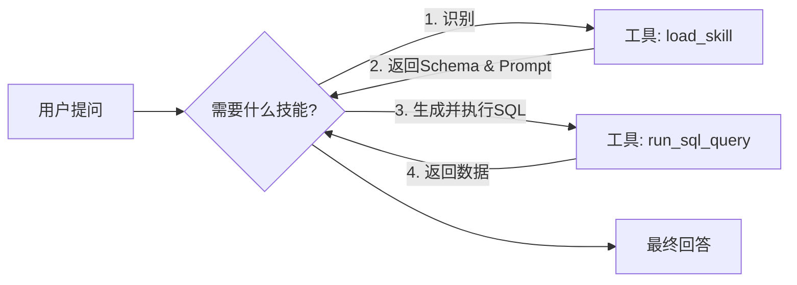

<div className="text-center">
  
  <p>LangChain（Photo by <a href="https://unsplash.com/@insungpandora?utm_source=unsplash&utm_medium=referral&utm_content=creditCopyText">insung yoon</a> on <a href="https://unsplash.com/photos/modern-dining-room-with-warm-natural-light-raTBX-Mo4x8?utm_source=unsplash&utm_medium=referral&utm_content=creditCopyText">Unsplash</a>
      ）</p>
</div>

在先前的文章中，我们探讨了如何通过 Deep Agents CLI 模拟 Deep Agent 使用 Skills 的模式。如今，LangChain 已原生支持这一特性，极大地简化了开发流程。本文将带领大家深入体验这一功能，构建一个更智能的 SQL 助手。

构建复杂的 AI Agent 时，开发者往往陷入两难境地：是将所有上下文（数据库表结构、API 文档、业务规则）一次性注入 System Prompt，导致上下文窗口（Context Window）溢出且分散模型注意力？还是选择成本高昂的频繁微调（Fine-tuning）？

**Skills 模式（Skills Pattern）** 提供了一条优雅的中间路线。它通过动态加载所需知识，实现了上下文的高效利用。LangChain 对此模式的原生支持，意味着我们可以更轻松地构建具备“按需学习”能力的 Agent。

本文将结合官方文档 [Build a SQL assistant with on-demand skills](https://docs.langchain.com/oss/python/langchain/multi-agent/skills-sql-assistant)，引导读者从零开始，构建一个支持“按需加载知识”的 SQL Assistant。

---

## 1. 核心概念：为何选择 Skills 模式？

### 传统 SQL Agent 的局限性
在传统的 SQL Agent 架构中，我们通常需要在 System Prompt 中提供完整的 Database Schema。随着业务发展，当表数量扩展到数百张时，这种方式会带来显著问题：
*   **Token 消耗巨大**：每次对话都携带大量无关的表结构，造成资源浪费。
*   **幻觉风险增加**：过多的无关干扰信息会降低模型的推理准确性。
*   **维护困难**：所有业务线的知识紧密耦合，难以独立迭代。

### Skills 模式：基于渐进式披露的解决方案
Skills 模式基于**渐进式披露（Progressive Disclosure）**原则，将知识获取过程分层处理：
*   **Agent 初始状态**：仅掌握有哪些“技能”（Skills）及其简要描述（Description），保持轻量级。
*   **运行时加载**：当面对具体问题（如“查询库存”）时，Agent 主动调用工具（`load_skill`）加载该技能详细的上下文（Schema + Prompt）。
*   **执行任务**：基于加载的精确上下文，执行具体的任务（如编写并执行 SQL）。

这种模式有效支持了**无限扩展**和**团队解耦**，使 Agent 能够适应日益复杂的业务场景。

---

## 2. 系统架构设计

本实战项目将构建一个包含两个核心 Skills 的 SQL Assistant，以演示该模式的实际应用：

1.  **Sales Analytics（销售分析）**：负责 `sales_data` 表，处理收入统计、订单趋势分析等。
2.  **Inventory Management（库存管理）**：负责 `inventory_items` 表，处理库存水平监控、位置查询等。

### 系统工作流 (Workflow)



---

## 3. 开发环境搭建

本项目采用 Python `uv` 进行高效的依赖管理。

### 核心依赖安装
```bash
uv add langchain langchain-openai langgraph psycopg2-binary python-dotenv langchain-community
```

### PostgreSQL 环境配置
本地启动一个 Postgres 实例，并创建 `agent_platform` 数据库。我们提供了 `setup_db.py` 脚本来自动初始化表结构和测试数据（详见文末源码）。

---

## 4. 核心实现步骤详解

### 步骤一：定义领域技能 (The Knowledge)
我们将技能定义为字典结构，模拟从文件系统或数据库加载的过程。请注意区分 `description`（供 Agent 决策选型使用）和 `content`（实际加载的详细上下文）。

```python
SKILLS = {
    "sales_analytics": {
        "description": "Useful for analyzing sales revenue, trends...",
        "content": """... Table Schema: sales_data ..."""
    },
    "inventory_management": {
        "description": "Useful for checking stock levels...",
        "content": """... Table Schema: inventory_items ..."""
    }
}
```

### 步骤二：实现核心工具 (The Capabilities)
Agent 依赖两个关键工具来完成任务：
*   `load_skill(skill_name)`: 在运行时动态加载指定技能的详情。
*   `run_sql_query(query)`: 执行具体的 SQL 语句。

### 步骤三：编排 Agent 逻辑 (The Brain)
利用 LangGraph 构建 ReAct Agent。System Prompt 在此处起着关键作用，它指导 Agent 严格遵循 `Identify -> Load -> Query` 的标准作业程序（SOP）。

```python
system_prompt = """
1. Identify the relevant skill.
2. Use 'load_skill' to get schema.
3. Write and execute SQL using 'run_sql_query'.
...
Do not guess table names. Always load the skill first.
"""
```

---

## 5. 运行效果验证

通过运行 `test_agent.py`，我们对 Sales 和 Inventory 两个不同领域的查询进行了测试。以下是控制台的实际输出日志，展示了 Agent 如何根据问题动态加载技能：

```text
Testing Sales Query...
Agent calling tools: [{'name': 'load_skill', 'args': {'skill_name': 'sales_analytics'}, 'id': 'call_f270d76b7ce4404cb5f61bf2', 'type': 'tool_call'}]
Tool output:
You are a Sales Analytics Expert.
You have access to the 'sales_data' table.
Table Schema:
- id: integer...
Agent calling tools: [{'name': 'run_sql_query', 'args': {'query': 'SELECT SUM(amount) as total_revenue FROM sales_data;'}, 'id': 'call_b4f3e686cc7f4f22b3bb9ea7', 'type': 'tool_call'}]
Tool output: [(Decimal('730.50'),)]...
Agent response: The total revenue is $730.50.

Testing Inventory Query...
Agent calling tools: [{'name': 'load_skill', 'args': {'skill_name': 'inventory_management'}, 'id': 'call_18c823b2d5064e95a0cfe2e3', 'type': 'tool_call'}]
Tool output:
You are an Inventory Management Expert.
You have access to the 'inventory_items' table.
Table Schema...
Agent calling tools: [{'name': 'run_sql_query', 'args': {'query': "SELECT warehouse_location FROM inventory_items WHERE product_name = 'Laptop';"}, 'id': 'call_647ee3a444804bd98a045f00', 'type': 'tool_call'}]
Tool output: [('Warehouse A',)]...
Agent response: The Laptop is located in **Warehouse A**.
```

---

## 6. 完整源码参考

以下是项目的完整源代码，包含数据库初始化脚本和 Agent 主程序。

### 1. 数据库初始化 (setup_db.py)

```python
import psycopg2
from psycopg2.extensions import ISOLATION_LEVEL_AUTOCOMMIT
import os
from dotenv import load_dotenv

load_dotenv()

# 请确保在 .env 中配置数据库连接信息
DB_HOST = os.getenv("DB_HOST", "localhost")
DB_PORT = os.getenv("DB_PORT", "5432")
DB_USER = os.getenv("DB_USER", "postgres")
DB_PASSWORD = os.getenv("DB_PASSWORD", "your_password") # 请替换为实际密码
DB_NAME = os.getenv("DB_NAME", "agent_platform")

def create_database():
    try:
        # Connect to default 'postgres' database to create new db
        conn = psycopg2.connect(
            host=DB_HOST,
            port=DB_PORT,
            user=DB_USER,
            password=DB_PASSWORD,
            dbname="postgres"
        )
        conn.set_isolation_level(ISOLATION_LEVEL_AUTOCOMMIT)
        cur = conn.cursor()
        
        # Check if database exists
        cur.execute(f"SELECT 1 FROM pg_catalog.pg_database WHERE datname = '{DB_NAME}'")
        exists = cur.fetchone()
        
        if not exists:
            print(f"Creating database {DB_NAME}...")
            cur.execute(f"CREATE DATABASE {DB_NAME}")
        else:
            print(f"Database {DB_NAME} already exists.")
            
        cur.close()
        conn.close()
    except Exception as e:
        print(f"Error creating database: {e}")

def create_tables_and_data():
    try:
        conn = psycopg2.connect(
            host=DB_HOST,
            port=DB_PORT,
            user=DB_USER,
            password=DB_PASSWORD,
            dbname=DB_NAME
        )
        cur = conn.cursor()
        
        # Create Sales Table
        print("Creating sales_data table...")
        cur.execute("""
            CREATE TABLE IF NOT EXISTS sales_data (
                id SERIAL PRIMARY KEY,
                transaction_date DATE,
                product_id VARCHAR(50),
                amount DECIMAL(10, 2),
                region VARCHAR(50)
            )
        """)
        
        # Create Inventory Table
        print("Creating inventory_items table...")
        cur.execute("""
            CREATE TABLE IF NOT EXISTS inventory_items (
                id SERIAL PRIMARY KEY,
                product_id VARCHAR(50),
                product_name VARCHAR(100),
                stock_count INTEGER,
                warehouse_location VARCHAR(50)
            )
        """)
        
        # Insert Mock Data
        print("Inserting mock data...")
        cur.execute("TRUNCATE sales_data, inventory_items")
        
        sales_data = [
            ('2023-01-01', 'P001', 100.00, 'North'),
            ('2023-01-02', 'P002', 150.50, 'South'),
            ('2023-01-03', 'P001', 120.00, 'East'),
            ('2023-01-04', 'P003', 200.00, 'West'),
            ('2023-01-05', 'P002', 160.00, 'North')
        ]
        
        cur.executemany(
            "INSERT INTO sales_data (transaction_date, product_id, amount, region) VALUES (%s, %s, %s, %s)",
            sales_data
        )
        
        inventory_data = [
            ('P001', 'Laptop', 50, 'Warehouse A'),
            ('P002', 'Mouse', 200, 'Warehouse B'),
            ('P003', 'Keyboard', 150, 'Warehouse A'),
            ('P004', 'Monitor', 30, 'Warehouse C')
        ]
        
        cur.executemany(
            "INSERT INTO inventory_items (product_id, product_name, stock_count, warehouse_location) VALUES (%s, %s, %s, %s)",
            inventory_data
        )
        
        conn.commit()
        cur.close()
        conn.close()
        print("Database setup complete.")
        
    except Exception as e:
        print(f"Error setting up tables: {e}")

if __name__ == "__main__":
    create_database()
    create_tables_and_data()
```

### 2. Agent 主程序 (main.py)

```python
import os
from typing import Annotated, Literal, TypedDict, Union, Dict

from dotenv import load_dotenv
from langchain_openai import ChatOpenAI
from langchain_core.tools import tool
from langchain_core.messages import SystemMessage, HumanMessage, AIMessage, ToolMessage
from langchain_community.utilities import SQLDatabase
from langchain_community.agent_toolkits import SQLDatabaseToolkit
from langgraph.graph import StateGraph, START, END, MessagesState
from langgraph.prebuilt import ToolNode, tools_condition

load_dotenv()

# --- Configuration ---
BASE_URL = os.getenv("BASIC_MODEL_BASE_URL")
API_KEY = os.getenv("BASIC_MODEL_API_KEY")
MODEL_NAME = os.getenv("BASIC_MODEL_MODEL")

DB_URI = f"postgresql://{os.getenv('DB_USER')}:{os.getenv('DB_PASSWORD')}@{os.getenv('DB_HOST')}:{os.getenv('DB_PORT')}/{os.getenv('DB_NAME')}"

# --- Database Setup ---
db = SQLDatabase.from_uri(DB_URI)

# --- Skills Definition ---
SKILLS: Dict[str, Dict[str, str]] = {
    "sales_analytics": {
        "description": "Useful for analyzing sales revenue, trends, and regional performance.",
        "content": """
You are a Sales Analytics Expert.
You have access to the 'sales_data' table.
Table Schema:
- id: integer (primary key)
- transaction_date: date
- product_id: varchar(50)
- amount: decimal(10, 2)
- region: varchar(50)

Common queries:
- Total revenue: SUM(amount)
- Revenue by region: GROUP BY region
- Sales trend: GROUP BY transaction_date
"""
    },
    "inventory_management": {
        "description": "Useful for checking stock levels, product locations, and warehouse management.",
        "content": """
You are an Inventory Management Expert.
You have access to the 'inventory_items' table.
Table Schema:
- id: integer (primary key)
- product_id: varchar(50)
- product_name: varchar(100)
- stock_count: integer
- warehouse_location: varchar(50)

Common queries:
- Check stock: WHERE product_name = '...'
- Low stock: WHERE stock_count < threshold
"""
    }
}

# --- Tools ---

@tool
def load_skill(skill_name: str) -> str:
    """
    Load the detailed prompt and schema for a specific skill.
    Available skills:
    - sales_analytics: For sales, revenue, and transaction analysis.
    - inventory_management: For stock, products, and warehouse queries.
    """
    skill = SKILLS.get(skill_name)
    if not skill:
        return f"Error: Skill '{skill_name}' not found. Available skills: {list(SKILLS.keys())}"
    return skill["content"]

@tool
def run_sql_query(query: str) -> str:
    """
    Execute a SQL query against the database.
    Only use this tool AFTER loading the appropriate skill to understand the schema.
    """
    try:
        return db.run(query)
    except Exception as e:
        return f"Error executing SQL: {e}"

@tool
def list_tables() -> str:
    """List all available tables in the database."""
    return str(db.get_usable_table_names())

tools = [load_skill, run_sql_query, list_tables]

# --- Agent Setup ---

llm = ChatOpenAI(
    base_url=BASE_URL,
    api_key=API_KEY,
    model=MODEL_NAME,
    temperature=0
)

llm_with_tools = llm.bind_tools(tools)

# --- Graph Definition ---

class AgentState(MessagesState):
    # We can add custom state if needed, but MessagesState is sufficient for simple chat
    pass

def agent_node(state: AgentState):
    messages = state["messages"]
    response = llm_with_tools.invoke(messages)
    return {"messages": [response]}

workflow = StateGraph(AgentState)

workflow.add_node("agent", agent_node)
workflow.add_node("tools", ToolNode(tools))

workflow.add_edge(START, "agent")
workflow.add_conditional_edges("agent", tools_condition)
workflow.add_edge("tools", "agent")

app = workflow.compile()

# --- Main Execution ---

if __name__ == "__main__":
    system_prompt = """You are a helpful SQL Assistant.
You have access to specialized skills that contain database schemas and domain knowledge.
To answer a user's question:
1. Identify the relevant skill (sales_analytics or inventory_management).
2. Use the 'load_skill' tool to get the schema and instructions.
3. Based on the loaded skill, write and execute a SQL query using 'run_sql_query'.
4. Answer the user's question based on the query results.

Do not guess table names. Always load the skill first.
"""
    
    print("SQL Assistant initialized. Type 'quit' to exit.")
    print("-" * 50)
    
    messages = [SystemMessage(content=system_prompt)]
    
    # Pre-warm connection check
    try:
        print(f"Connected to database: {DB_URI.split('@')[-1]}")
    except Exception as e:
        print(f"Database connection warning: {e}")

    while True:
        try:
            user_input = input("User: ")
            if user_input.lower() in ["quit", "exit"]:
                break
            
            messages.append(HumanMessage(content=user_input))
            
            # Stream the execution
            print("Agent: ", end="", flush=True)
            final_response = None
            
            for event in app.stream({"messages": messages}, stream_mode="values"):
                # In 'values' mode, we get the full state. We just want to see the last message if it's new.
                last_message = event["messages"][-1]
                
                # Update our message history with the latest state
                pass
            
            # After stream finishes, the last state has the final answer
            final_state = app.invoke({"messages": messages})
            last_msg = final_state["messages"][-1]
            
            if isinstance(last_msg, AIMessage):
                print(last_msg.content)
                messages = final_state["messages"] # Update history
            
            print("-" * 50)
            
        except Exception as e:
            print(f"\nError: {e}")
            break
```
