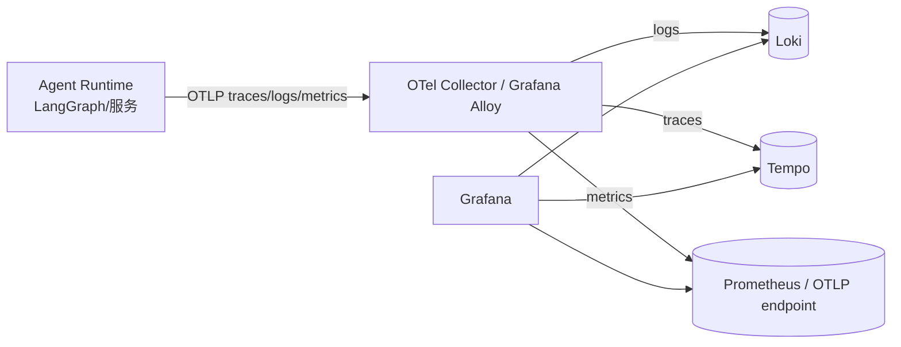
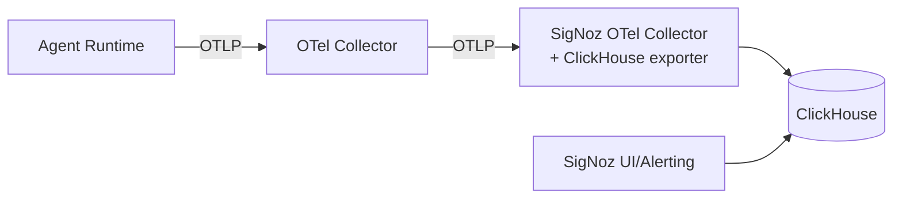

  
  
Monitoring in Production（Photo by <a href="https://unsplash.com/@anleo?utm_source=unsplash&utm_medium=referral&utm_content=creditCopyText">Alvin Leopold</a> on <a href="https://unsplash.com/photos/white-metal-frame-GXIZjLK1D4k?utm_source=unsplash&utm_medium=referral&utm_content=creditCopyText">Unsplash</a>）

> 系列导读: 本文是《Building Applications with AI Agents》系列解读的第五篇。在[第一篇](https://apframework.com/blog/essay/2026-02-15-agent-types)中，我们探讨了智能体的六大核心类型；在[第二篇](https://apframework.com/blog/essay/2026-02-16-agent-tool-selection)中，我们分析了工具选择与 MCP；在[第三篇](https://apframework.com/blog/essay/2026-02-17-multiagent-coordination)中，我们深入解析了多智能体协作与编排模式；在[第四篇](https://apframework.com/blog/essay/2026-02-19-Validation-Measurement)中，我们聚焦于验证与测量。本篇将深入生产环境，探讨如何构建可解释、可告警、可闭环的监控体系。

## 1. 为什么 2026 年的 Agent 监控更难、更重要？

一旦 Agent 上线，“发布成功”只完成了一半。真正的挑战从生产开始：真实用户输入是无界的，外部工具与数据源随时变化，模型本身又是概率系统。你无法像传统软件那样为所有情况写出穷举测试，于是监控成为 Agent 体系的“神经系统”——让团队看见正在发生什么、为什么发生、该如何快速纠偏。

### 1.1 Agent 与传统软件的监控差异

| 维度 | 传统软件（典型） | Agentic AI（典型） | 监控侧含义 |
|---|---|---|---|
| 决策与输出 | 确定性（给定输入输出基本固定） | 概率性（同输入可能不同输出） | 需要区分“期望波动”与“系统性退化” |
| 执行路径 | 代码路径相对固定 | 规划 + 多步工具链路，路径动态变化 | 需要 Traces 记录完整因果链 |
| 失败形态 | 常见为崩溃/异常/5xx | 常见为“隐性失败”：答非所问、工具选错、事实不一致 | 需要语义指标与用户信号 |
| 外部依赖 | 依赖相对稳定 | 工具/API/权限/数据持续变化 | 需要把“工具健康”纳入核心 SLI |
| 质量度量 | 以可用性、延迟为主 | 还要度量“任务是否完成”“是否可信” | 需要定义可操作的成功判据与 eval 信号 |

### 1.2 三类“更难”的根因

#### A. 概率性决策：失败不一定可复现

同一个提示与上下文，模型输出会有波动。这带来一个常见误区：把一次性坏输出当作事故，导致告警噪声；或者把慢性变差当作“只是随机”。更合理的思路是把“任务成功”从单点判断升级为统计判断：

- 单次失败：记录并进入“漂移与质量观察池”
- 多次复现（例如重跑 3–5 次失败率仍很高）：更可能是系统性问题（提示退化、工具故障、约束失效）
- 长期趋势退化：更可能是生产衰退或漂移（见第 5 章）

#### B. 长链路工具调用：局部成功可能导致整体失败

Agent 的链路通常包含：识别意图 → 规划 → 选择工具 → 调用工具 → 解释结果 → 生成回答。任何一步的轻微偏差都可能级联：

- 工具调用返回 200，但语义含义改变（字段变更、默认排序变更）→ 答案“看起来合理但错误”
- 工具偶发超时 → 重试 → 触发预算限制 → 被迫降级 → 用户放弃
- 规划出现循环 → token 成本飙升 → 端到端延迟上升 → 体验下降

因此，2026 年的监控必须能回答“端到端发生了什么”：这不是单靠日志能解决的，需要 trace 把多步因果链串起来（第 2 章）。

#### C. 外部世界持续变化：慢性退化是常态

在生产里，变化来自四面八方：用户语言、业务术语、工具 API、权限策略、模型版本、提示版本。于是出现两类 2025–2026 年最常见痛点：

- 生产衰退（production decay）：系统“没有大事故”，但 KPI 逐步变差（更慢、更贵、更不准）
- Agent 漂移（agent drift）：输入/输出/行为分布偏离历史基线，导致策略失效（例如工具使用结构变化、成功路径改变）

### 1.3 监控的定位：从“发现故障”升级为“学习闭环”

传统监控的终点常是“恢复服务”。而对 Agent 来说，监控更像一个持续学习系统：

  
  
Agentic AI Observability & Governance Framework

1. 观测：把运行时事件标准化采集（工具调用、生成、回退、重试、评估）
2. 诊断：能从现象定位到因果链（trace + 结构化日志 + 指标）
3. 纠偏：通过降级/限权/切换版本/转人工降低风险
4. 回流：把失败与成功的链路固化为回归样本（失败 trace 变测试用例；成功 trace 变 golden path）

这一点决定了本文的核心目标：从反应式 → 主动式 → 自适应式监控。

## 2. 2026 推荐的开源/混合可观测性技术栈

这一章的关键不是“选一个工具”，而是理解各组件的职责边界，并组合成一条可治理的观测流水线。2026 年最常见的企业落地形态是：用 OpenTelemetry 统一采集与语义规范，用 Grafana 生态或 SigNoz 做后端与前台，再叠加一层 Agent-aware 平台做“会话回放与评估”。

### 2.1 先把基本概念说清楚：Logs / Metrics / Traces

- Logs（日志）：离散事件流。适合记录“发生了什么”（例如工具调用参数、错误码、降级原因）。要在 Agent 场景里好用，几乎必须结构化（JSON）并携带 `trace_id`。
- Metrics（指标）：可聚合的数值时间序列。适合 SLO、告警与趋势（例如端到端成功率、P95 延迟、token 成本）。
- Traces（链路）：一次会话/一次请求的因果链。由多个 span 组成，用来回答“为什么会慢/会失败/会循环”，是 Agent 排障与回归固化的核心载体。

三者不是替代关系：Logs 提供细节，Metrics 提供趋势与告警，Traces 提供因果链。

### 2.2 OpenTelemetry（OTel）：统一采集与语义规范的“地基”

如果你只记住一句话：OTel 的价值不在于“某个后端”，而在于它把采集、上下文传播与字段语义标准化，从而支持一套数据同时喂给多个系统。

#### 2.2.1 OTel 的关键名词

- OTLP：OpenTelemetry Protocol。应用/Collector 把 traces、metrics、logs 以 OTLP（gRPC/HTTP）发往后端或中继。
- Collector：采集与转发中枢。做接收（receivers）、处理（processors）、导出（exporters），以及脱敏/采样/路由等治理。
- Semantic Conventions：字段语义约定。它规定 span/metric/log 上“应该叫什么、应该怎么填”，让不同服务的数据能互相理解与关联（例如统一的 `service.name`、错误类型字段等）。这类约定在 OTel 生态里非常成熟，并持续扩展到更多系统与场景。

#### 2.2.2 Agent 场景的语义建议（实用版）

为了把“基础设施监控”与“语义行为监控”放在同一张图里，你需要统一标签与维度（注意控制基数）：

- 必备资源级标签（低基数）：`service.name`、`deployment.environment`（prod/staging）、`service.version`
- Agent 业务维度（中低基数）：`agent.name`、`workflow.id`、`feature.flag`、`tenant` 或 `user.tier`
- 模型与提示维度（中低基数）：`model.provider`、`model.name`、`model.version`、`prompt.version`
- 工具维度（中低基数）：`tool.name`、`tool.endpoint`（可脱敏/归一化）、`tool.error_type`
- 会话关联（高基数）：`trace_id`、`session_id`、`request_id`（只用于日志与 trace，不要当作 metrics 标签）

### 2.3 参考落地拓扑 A：Grafana 生态（Loki + Tempo + Prometheus + Grafana）

这条路径的优势是“可组合、成熟、企业常见”，也最适合复用既有监控体系。

#### 2.3.1 Loki：为什么强调“结构化 + trace_id”

Agent 的日志通常包含用户输入、工具参数、模型输出片段等敏感信息，必须做脱敏与权限隔离（第 8 章会展开）。但从可观测性角度，最关键的是“日志能跳转到 trace”：

- 你在日志里看到 `tool_timeout`，点击就能打开同一 `trace_id` 的完整链路（前后发生了哪些 span、是否循环、是否降级）
- 这要求日志至少包含：`trace_id`、`span_id`（可选）、`service.name`、`agent.name`、`workflow.id` 等

Grafana 支持配置“Trace to Logs”关联：用 trace 中的 `traceID` 与 `service.name` 拼出 Loki 查询，从 trace 反查同一链路的日志，实现一键联动。

#### 2.3.2 Tempo：为什么它更适合“多步链路 + 低成本”

Tempo 是 tracing 后端，强调可扩展与对象存储友好。Agent 的链路通常更长、span 更多，Tempo 能以较低成本保留足够多的 trace，用于：

- 排障：定位哪个节点慢、哪个工具失败、哪里触发回退
- 对比：同一 workflow 在不同版本的路径差异（shadow/canary 场景）
- 回归固化：抽取失败 trace，脱敏后进入回归样本库（第 4 章）

#### 2.3.3 Prometheus：指标与告警的成熟底座

Prometheus 适合承载关键 SLI（成功率、错误率、延迟、成本）并驱动告警。2026 年的建议是：让“语义指标”也走同一条 metrics 管道，避免出现“产品看产品仪表盘、SRE 看 infra 仪表盘、ML 看 notebook”各说各话的局面（第 6 章）。

#### 2.3.4 Grafana Alloy：为什么企业越来越常用

Alloy 可以理解为“带 Prometheus 管道能力的 OTel Collector 发行版”，适合把采集侧治理前置（路由、过滤、脱敏、批处理、重标记），并把 OTel 与 Prometheus 生态更好地融合。

### 2.4 参考落地拓扑 B：SigNoz（一体化 OTel-native）

当团队希望“少组件、快落地、UI 一体化”，SigNoz 是常见选择：它以 OTel 为核心采集协议，把 logs/metrics/traces 统一落到 ClickHouse，并提供一体化查询与告警能力。

理解这条路径的关键点：

- SigNoz 提供自己的 Collector 发行版，包含面向 ClickHouse 的导出能力；如果你有多级 Collector，通常需要保证最终写入 ClickHouse 的那一跳是 SigNoz 的 Collector。
- 一体化的代价是生态可组合性略弱于 Grafana 全家桶，但对小团队或绿地项目很友好。

### 2.5 Agent-aware 平台：为什么“仅有可观测性”还不够

OTel + LGTM/SigNoz 解决的是“可观测性”：看见链路、告警、定位问题。但 Agent 还有两类强需求：

1. 会话回放：把一次用户会话的多轮上下文、工具调用与输出串起来复盘
2. 评估（eval）：把“是否有用、是否幻觉、是否符合规范”变成可度量信号（在线或离线）

因此 2026 的常见组合是“混合落地”：

- 运行时：OTel → Grafana/Loki/Tempo/Prometheus（或 SigNoz）
- 语义层：并行出站到 Langfuse / Phoenix / LangSmith 等，用于 prompt/model 版本对比、session 回放、质量打分与回归集构建

### 2.6 选型建议：别从“工具”开始，从“组织现状”开始

- 已有成熟企业监控：优先扩展现有体系，用 OTel 把 Agent 信号接入同一套平台。
- 绿地项目/小团队：SigNoz 一体化能减少运维负担，先把链路、指标、告警跑起来。
- 强依赖评估与回放：引入一套 Agent-aware 平台叠加在 OTel 管道之上，不要用它替代基础观测。

## 3. 监控指标体系：精简四层

指标不是“越多越好”，而是“能驱动行动”。下面用四层结构把指标体系拆解为可落地的 SLI：每个指标都要能回答三件事：如何采集、阈值怎么定、告警后怎么处理。

### 3.1 四层指标总览

| 层 | 关注点 | 典型问题 | 常用载体 |
|---|---|---|---|
| 基础设施与稳定性层 | 系统是否稳定可用 | 延迟飙升、错误率升高、成本爆炸 | Metrics + Traces |
| 执行质量层 | Agent 是否“做对了事” | 循环、工具选错、计划失败、事实不一致 | Traces + Metrics + Evals |
| 用户体验与语义层 | 用户是否“感到有用” | 放弃率升高、重问增多、首答失败 | Metrics + 事件日志 |
| 漂移与长期稳定性层 | 环境是否变了 | 输入/输出/行为分布偏离，版本退化 | 统计检测 + 趋势指标 |

### 3.2 指标表（可直接用于落地与告警）

以下表格把指标写成“可操作规格”。阈值仅作示例，建议以历史基线与业务风险分级来定。

| 指标（SLI） | 定义（如何算） | 采集位置 | 推荐标签（低/中基数） | 阈值示例 | 常见根因 | 典型动作 |
|---|---|---|---|---|---|---|
| 端到端成功率 | 满足成功判据的会话数 / 总会话数 | 工作流结束节点（终态） | `agent.name` `workflow.id` `service.version` | 24h 下降 > 2–5% | 提示退化、工具变化、漂移 | 触发回归、降级、回滚、shadow 对比 |
| P95/P99 端到端延迟 | request → final response | trace 根 span + 终态事件 | `agent.name` `workflow.id` | P95 上升 > 50% | 循环、工具慢、模型变慢 | 跳过可选步骤、切模型、缓存、限流 |
| 工具调用错误率 | 工具调用失败数 / 调用总数 | 工具调用 span | `tool.name` `error.type` | 30m > 1–3% | 下游故障、权限、限流 | 自动重试退避、切备用、降级路径 |
| 重试率/循环率 | 单会话重试次数或重复节点比例 | trace 分析 + 事件日志 | `agent.name` `workflow.id` | 会话中 > N 次重试占比升高 | 规划不稳、工具不确定 | 增加终止条件、改规划策略、加澄清问题 |
| token 成本（每会话/每用户） | input+output tokens 或金额 | LLM 生成 span + 计费器 | `model.name` `prompt.version` | 24h 上升 > 20–30% | 提示膨胀、循环、模型切换 | 压缩上下文、摘要、限预算、分层模型 |
| 降级/回退频率 | 触发 fallback 的会话占比 | 决策节点事件 | `fallback.type` `workflow.id` | 1h 上升显著 | 工具不稳、规则过严 | 调整阈值、修工具、优化回退策略 |
| 工具选择正确率 | 选中正确工具的比例（基于回放/评估） | 离线 eval 或在线 critic | `tool.name` `prompt.version` | 低于基线 | 意图识别错、提示退化 | 优化路由、加约束、增加 few-shot |
| 幻觉/事实不一致率 | “事实校验失败”的输出占比 | 在线/离线 critic | `workflow.id` `model.version` | 30m > 5% | grounding 不足、工具数据异常 | 强制引用来源、加验证步骤、转人工 |
| 首次尝试成功率 | 不需要用户重问/改写的成功率 | 会话事件 | `agent.name` `workflow.id` | 24h 下降 | 指令理解差、澄清不足 | 增加澄清问题、优化提示与 UI |
| 任务放弃率 | 用户中途退出/无后续的占比 | 前端埋点 + 会话终态 | `workflow.id` `user.tier` | > 15%（示例） | 过慢、答非所问、流程复杂 | 优化交互、加进度提示、缩短链路 |
| 输入漂移（PSI/KS/Embedding） | 与基线分布差异 | 离线批处理 | `workflow.id` | PSI > 0.25 等 | 用户语言变化、新业务 | 更新分类/提示、补数据、灰度验证 |
| 行为漂移（工具分布变化） | 工具调用占比结构变化 | logs/metrics | `agent.name` `tool.name` | 相对变化 > X% | 路由退化、工具健康差 | 排障工具、修路由、回滚提示 |

### 3.3 关键落地原则：指标必须“可解释、可归因、可治理”

- 可解释：每个指标要能落到 trace 的具体 span/事件，否则只会“看到红灯但不知道为什么”。
- 可归因：指标要按 `service.version`、`prompt.version`、`model.version`、`workflow.id` 分桶，才能支撑 shadow/canary 的版本对比。
- 可治理：控制 metrics 标签基数；把高基数（session_id、trace_id、user_id）留在 logs/traces，不要塞进 metrics 标签。

这一章的结果应该是：团队能列出一张“最小可用指标集（MVI）”，并把告警接到明确的处置动作上。第 4 章会把这些指标接入安全发布模式，第 5 章会把漂移检测做成可运行的操作手册。

## 4. 2026 主流 Agent 安全发布与监控模式

Agent 的发布不只是“发代码”，而是“发行为”。由于行为具有概率性与环境依赖性，2026 年更推荐把发布与监控绑定为一套“安全阀系统”：先观测，再放量；先对比，再替换；先限权，再自治。

### 4.1 Shadow / Dark Launch：最低风险验证新版本的首选

Shadow 模式的核心：新版本与旧版本同时跑同一份真实输入，但新版本输出不对用户可见。它适合验证：

- 更换模型版本、提示版本、规划策略
- 新增/替换工具
- 调整安全策略与限权逻辑

落地要点：

- 统一关联 ID：确保 shadow 与 baseline 共享同一 `request_id`/`session_id`，并在 trace 里打上 `agent.variant=baseline|shadow`。
- 指标对比：至少对比端到端成功率、P95 延迟、token 成本、循环率、工具错误率、幻觉/事实不一致率。
- 数据隔离：shadow 也会产生包含敏感内容的日志与输出，脱敏与 RBAC 不能因为“用户看不到”而放松。

### 4.2 Canary：渐进式放量 + 自动回滚

Canary 的核心：让少量真实用户使用新版本，同时用监控做“门禁”。典型放量策略：1% → 5% → 20% → 50% → 100%，每一步都有必须达标的 SLO。

#### Canary 与 Shadow 的对比

| 模式 | 是否影响用户 | 能否验证真实体验 | 风险 | 推荐用途 |
|---|---:|---:|---:|---|
| Shadow/Dark Launch | 否 | 部分（不含用户反应） | 低 | 大改动的预验证、搜集回归样本 |
| Canary | 是（小流量） | 是 | 中 | 逐步替换、验证真实体验与商业指标 |

#### Canary 的“监控门禁”模板（可直接复用）

你可以把门禁分为三类：稳定性门禁、质量门禁、体验门禁。

- 稳定性门禁（硬门槛）
  - 工具错误率不高于 baseline + Δ
  - P95 端到端延迟不高于 baseline × (1 + Δ)
  - token 成本不高于 baseline × (1 + Δ)
- 质量门禁（软硬结合）
  - 端到端成功率不低于 baseline − Δ
  - 循环率/重试率不高于 baseline + Δ
  - 幻觉/事实不一致率不高于阈值（或不高于 baseline + Δ）
- 体验门禁（与产品共识）
  - 放弃率不升高
  - 首次成功率不下降
  - 显式负反馈不升高

一旦触发门禁，动作优先级应当是：停止放量 → 自动回滚 → 进入排障与回归修复流程。

### 4.3 持续失败 Trace 收集：把生产问题变成回归资产

Agent 的失败往往是“语义失败”，很难被传统单元测试覆盖。2026 的高效做法是把生产失败当作测试集增量：

1. 定义“失败样本入口”：低成功判据、低用户评分、循环超限、工具连续失败、幻觉评分高等。
2. 自动打包证据：同一 `trace_id` 的关键 spans + 结构化日志 + 终态标签（失败类型、工具、版本）。
3. 脱敏与分级存储：敏感内容脱敏后进入回归库；原始内容仅限受控权限访问。
4. 固化为回归用例：修复后必须在这批 trace 上通过，防止复发。

对应地，“成功”也应沉淀：见 4.6 的 Golden/Silver Path。

### 4.4 Bounded Autonomy：给 Agent 设定“可控的自治边界”

Bounded Autonomy 的目标不是让 Agent 更保守，而是让它在可接受风险内更稳定地扩张能力。典型做法是定义一组“升级阈值”：

| 触发信号 | 典型阈值示例 | 自动动作（先） | 升级动作（后） |
|---|---|---|---|
| 工具连续失败 | 同工具连续失败 ≥ 2 次 | 切备用工具/降级路径 | 转人工或停止该流程 |
| 循环/重试过多 | 规划循环 ≥ N 次 | 终止循环、请求澄清 | 记录为回归样本 |
| token 预算耗尽风险 | 消耗 > 预算 80% | 压缩上下文/跳过可选步骤 | 切更便宜模型或转人工 |
| 幻觉风险高 | 评分超过阈值 | 强制引用来源/加验证 | 限制输出或转人工 |

关键点在于：每个自动动作都要写入事件（原因、阈值、采取的策略），并在 trace 中可见，便于后续复盘与优化。

### 4.5 实时自我修正信号：用监控驱动“自愈”而不是“硬扛”

自愈不是魔法，而是一套可观测的策略切换：

- 高重试/高延迟：降级到更短链路（少工具、少步骤）
- 工具故障：切备用工具、缓存、或输出“可验证的部分”并明确不确定性
- 高幻觉风险：触发校验步骤（再查询一次工具、或要求引用来源），必要时转人工

把这些策略当作产品能力而不是临时补丁：策略本身也需要指标（触发频率、成功率、对体验的影响）。

### 4.6 Golden Path / Silver Path：把“最好与可接受的行为”变成基线

- Golden Path：高价值任务中表现稳定、用户反馈好的典型链路。用途：版本对比、回归基线、成本与延迟基线。
- Silver Path：不完美但可接受的链路（例如需要一次澄清才能完成）。用途：定义“可接受波动边界”，避免对正常变体过度告警。

构建流程建议：

1. 从生产按业务价值与覆盖面抽样
2. 结合用户反馈与质量评估筛选
3. 脱敏与标注（任务类型、成功判据、允许波动范围）
4. 固化为持续回归集，并在每次 canary 前后对比

## 5. 生产环境漂移检测与响应实操

漂移不是“某次输出不好”，而是“分布在变”。它可能来自用户语言变化、业务术语变化、工具数据变化、模型/提示版本变化。最危险的漂移是那种不报错、但持续侵蚀成功率与体验的慢性变化。

### 5.1 三个经典统计指标：PSI / KS / KL（各自擅长什么）

#### PSI（Population Stability Index）

PSI 适合观察“分箱后的比例变化”，常用来监测：

- 用户请求类型占比变化（分类后）
- 工具使用类别占比变化
- 某些连续特征分箱后的分布变化（例如 query 长度分箱）

经验阈值（行业常见口径）：

- PSI < 0.1：稳定
- 0.1–0.25：轻微漂移（观察）
- > 0.25：重大漂移（介入）

误报常见来源：分箱策略不稳定、样本量太小、节假日/活动导致短期结构变化。

#### KS（Kolmogorov–Smirnov）检验

KS 适合比较两个连续分布是否发生显著变化，常用来监测：

- query 长度、延迟分布、token 分布等连续特征
- 某些评分分布（例如“事实一致性评分”）

KS 的价值在于不要求分布形状假设，但要注意：KS 对样本量敏感，建议配合时间窗与最小样本量门槛，并把“统计显著”与“业务显著”分开看。

#### KL（Kullback–Leibler）散度

KL 适合比较概率分布的偏离程度，常用于：

- 词/意图类别概率分布变化
- 输出类别分布变化（例如某些模板输出比例）

KL 不对称，且对零概率敏感，工程上要做平滑与归一化，避免被稀疏噪声放大。

### 5.2 2026 更推荐的双轨：Embedding 级漂移 + 行为 KPI 漂移

仅靠统计指标往往难以覆盖“语义变化”。更稳健的组合是：

1. Embedding 级漂移：把输入（或输出）编码为向量，监测与历史基线的相似度分布变化。
2. 行为 KPI 漂移：监测工具使用分布、回退频率、循环率、成功率等“行为层面”的变化。

双轨的好处是：即使语义漂移先发生、KPI 还没崩，也能早期预警；反之，如果 KPI 崩了但 embedding 看不出来，也能通过行为层定位是工具、提示还是规划逻辑的问题。

工程建议（避免过度复杂化）：

- Embedding 基线：按 `workflow.id` 建立基线，而不是全站一个大基线。
- 相似度口径：用时间窗（例如 7 天滚动）而不是固定不变的历史值。
- 采样策略：对高频低价值流量采样，保留高价值与失败链路全量。

### 5.3 漂移响应分级（Level 0–3）：把“检测”变成“处置手册”

漂移检测没有响应等于没做。下面是一套可运行的分级响应：

| 等级 | 触发条件（示例） | 自动化动作 | 人工动作 |
|---|---|---|---|
| Level 0 记录+告警 | 轻微漂移（PSI 0.1–0.25）或早期 embedding 变化 | 标记版本与时间窗、入库样本 | 在例会中复盘趋势 |
| Level 1 自动降级/改写 | KPI 轻度退化或工具错误率上升 | 触发降级策略、改写提问、增加澄清 | 确认是否需要修工具/提示 |
| Level 2 暂停当前版本 | 明显退化或门禁失败 | 自动停止放量、切回 baseline/shadow | 快速排障、决定修复路径 |
| Level 3 触发再评估流水线 | 重大漂移持续或高风险任务受影响 | 自动生成回归包（trace+日志+标注） | 启动专项评估、必要时重训/重构 |

关键实践：把“漂移事件”当作一次“可追溯的发布事件”管理，必须带版本号、时间窗、影响面与处置结论。

### 5.4 决策框架：漂移 ≠ 一定要重训

重训成本高、风险也高。多数情况下，处置顺序应当是：

1. 先止血：降级/限权/回滚/转人工
2. 再定位：是输入变了、工具变了、模型变了、还是提示变了
3. 再修复：更新路由与提示、修工具适配、补评估集
4. 最后才考虑：重训或更换模型（并走 shadow/canary）

## 6. 跨团队指标治理与责任归属（RACI 2.0）

2026 年最常见的失败不是技术失败，而是治理失败：没人真正对“端到端任务成功率”负责，导致指标在不同团队的仪表盘里互相甩锅。Agent 的链路跨越产品、平台、ML、数据、SRE，任何单一视角都不完整。

### 6.1 为什么端到端成功率必须共同负责

- 一次工具调用循环 4 次不是“后端小问题”，它直接变成用户等待与成本上涨。
- 一次计划过长不是“模型慢”，往往是提示与流程设计导致的冗余。
- 一次事实不一致不是“偶发输出”，可能是工具数据变化或验证链路缺失。

这些问题只有把 logs、traces、metrics 与用户信号放到同一个平台，跨团队一起看，才会暴露并被修复。

### 6.2 RACI 模板（可按组织结构调整）

| 指标/活动 | 产品团队 | 平台/工程 | ML/数据 | SRE/基础设施 |
|---|---|---|---|---|
| 端到端成功率（定义成功判据） | A/R | C | C | I |
| 端到端延迟（体验门槛） | A/C | R | C | R |
| 工具稳定性（错误率、SLA） | I/C | R | C | A/R |
| token 成本与预算 | C | R | R | A/R |
| 幻觉/事实不一致率 | C | C | A/R | I |
| 漂移检测与响应 | I/C | C | A/R | C |
| Shadow/Canary 门禁 | C | A/R | R | A/R |
| 仪表盘与告警维护 | I | R | C | A/R |

说明：

- A（Accountable）：对结果负责（谁来拍板、背 KPI）
- R（Responsible）：做事的人（谁实现、谁值班、谁修）
- C（Consulted）：提供输入（阈值、业务影响、评估口径）
- I（Informed）：知会（同步趋势即可）

### 6.3 例行机制：把“看板”变成“动作”

建议建立三种节奏：

1. 发布后回看（Release Review）
   - Canary 指标对比：成功率、延迟、成本、循环率、负反馈
   - Top 失败 trace 复盘：按失败类型聚类，抽样 10–20 条
2. 周度健康审计（Weekly Health）
   - 漂移趋势：输入/行为/输出分布变化
   - Golden/Silver Path 回归结果：是否出现退化
3. 重大回归处置（Incident + Learning）
   - 先止血（回滚/降级/转人工）
   - 后学习（失败 trace 回流 → 新增回归用例 → 发布门禁更新）

### 6.4 发布门禁（治理落地的最后一公里）

把第 3 章的关键 SLI 转成“发布必须过的门”，并明确：

- 门禁指标谁定义（产品/平台/ML）
- 门禁谁执行与谁有回滚权限（平台/SRE）
- 门禁失败后的标准动作（停止放量、回滚、进入修复队列）

## 7. 2026 年监控的终极价值主张

当团队把监控做对，监控不再是“防爆炸”，而会自然进化成三种能力。

### 7.1 学习加速器：把生产 trace 变成 eval 与回归资产

- 失败不是事故尾声，而是测试用例的开端。
- 成功不是理所当然，而是 golden path 的来源。
- 真实世界的复杂度会持续注入你的回归集，让 CI/CD 更贴近生产。

### 7.2 风险围栏：有界自治下的安全阀与自动降级

你无法消除概率性，但可以用策略限制风险：

- 高风险任务强制验证与引用
- 工具故障自动切换与降级
- 预算与循环阈值强制终止
- 关键路径失败升级人工

这些围栏可观测、可度量、可回放，才能持续优化而不是越修越乱。

### 7.3 商业放大器：可理解、可优化、可信任

当行为变得可解释（traces）、变化可见（metrics）、问题可复盘（logs），团队才能稳定地扩大自动化规模：

- 新功能上线敢放量（因为能 shadow/canary）
- 成本能控（因为 token 与链路可解释）
- 质量能进化（因为失败会回流为回归）

### 7.4 一份可执行的“明天就能开始”的行动清单

- 定义 3 个端到端成功判据（按 workflow 划分），并打通终态事件。
- 统一 trace_id：让每条关键日志都能跳到同一条 trace。
- 建立最小可用指标集（成功率、P95、成本、工具错误率、循环率、放弃率）。
- 先上 Shadow 再上 Canary，把版本对比做成默认流程。
- 把 Top 失败 trace 自动打包、脱敏并进入回归库。
- 为每个关键指标写出 owner 与处置动作，把“看见”变成“行动”。

## 8. 附录：术语表、落地 Checklist、常见坑与反模式

### 8.1 术语表（快速对齐）

| 术语 | 解释（工程视角） |
|---|---|
| Agentic AI | 会规划、会调用工具、会多步执行任务的系统，故障常为“语义偏差+级联”。 |
| Observability（可观测性） | 通过 logs/metrics/traces 推断内部状态并定位因果链。 |
| Logs | 事件记录，适合细节与证据；建议结构化并携带 `trace_id`。 |
| Metrics | 可聚合时间序列，适合趋势、SLO、告警与容量规划。 |
| Traces | 一次请求/会话的执行链路；由多个 span 组成，适合根因分析。 |
| Span | trace 中的一个步骤片段（如一次工具调用、一次模型生成、一次回退决策）。 |
| trace_id | 链路唯一标识，用于在日志、指标与 trace 之间关联。 |
| OpenTelemetry（OTel） | 统一采集与语义规范体系，支持 traces/metrics/logs 的标准化与多后端输出。 |
| OTLP | OTel 的传输协议，用于上报 traces/metrics/logs。 |
| Collector | 采集/处理/导出的中枢，做批处理、采样、脱敏、路由与转发。 |
| Semantic Conventions | 字段语义约定，统一“叫什么、怎么填”，便于跨系统聚合与关联。 |
| Grafana | 可视化与告警前台，可把 Loki/Tempo/Prometheus 等数据源联动。 |
| Loki | 日志后端，偏“标签索引+原始日志”，成本友好。 |
| Tempo | tracing 后端，适合大规模存储 trace 并与 Grafana 深度集成。 |
| Prometheus | 指标生态与告警基础设施成熟，适合承载关键 SLI/SLO。 |
| Grafana Alloy | 基于 OTel Collector 的发行版，强化采集侧可编排与 Prometheus 管道能力。 |
| SigNoz | OTel-native 的一体化可观测性平台，常以 ClickHouse 作为统一存储。 |
| Agent-aware 平台 | 面向 LLM/Agent 的会话回放、评估、prompt/model 版本对比与数据集管理能力（常与基础观测叠加）。 |
| SLI / SLO | SLI 是指标口径；SLO 是目标门槛与发布/运维策略依据。 |
| Shadow / Dark Launch | 新版本吃真实输入但不对用户输出，用于低风险验证与对比。 |
| Canary | 小流量真实放量，达标再逐步扩大；配合自动回滚。 |
| Golden Path / Trace | 高质量成功链路样本，用作回归与基线对比。 |
| Silver Path | 可接受但不完美的链路样本，用来界定“正常波动边界”。 |
| Bounded Autonomy | 有界自治：为 Agent 设定预算、权限、阈值与升级策略。 |
| Production Decay | 无明显事故但 KPI 逐步变差的慢性退化。 |
| Agent Drift | 输入/输出/行为分布偏离历史基线，导致策略失效或退化。 |
| PSI / KS / KL | 常见分布变化检测指标/检验（各有适用场景与误报风险）。 |
| Embedding Drift | 用向量相似度分布监测语义层输入/输出变化。 |

### 8.2 落地 Checklist（最小可行到生产级）

#### A. 埋点与关联（Instrumentation）

- 为每个会话生成 `trace_id`，贯穿：入口请求、规划、工具调用、回退、终态输出。
- 关键 spans 统一命名规则（按 workflow 与节点职责），并打上版本维度：`service.version`、`model.version`、`prompt.version`。
- 结构化日志默认携带：`trace_id`、`agent.name`、`workflow.id`、`tool.name`（如适用）、`error.type`（如适用）。
- 控制指标标签基数：高基数字段仅写入 logs/traces，不进 metrics 标签。

#### B. 数据管道与存储（Collector/Gateway）

- Collector 侧配置批处理与重试，避免峰值把后端压垮。
- 采样策略分层：失败链路/高价值链路优先全量；低价值高频链路可采样。
- 日志与 trace 的保留期分级：热数据短保留+冷数据长保留（按成本与排障需求定）。

#### C. 脱敏、隔离与权限（Security）

- 明确哪些字段可能包含敏感信息：用户输入、工具参数、模型输出、内部提示片段。
- 在 Collector 侧做脱敏/哈希/遮罩，并记录脱敏规则版本，保证排障可解释。
- 对观测数据启用 RBAC 与审计，按角色区分“看原文”与“看脱敏后的摘要”。
- 对高敏工作流做隔离（独立租户/独立集群/独立索引），避免横向泄漏。

#### D. 仪表盘与告警（Dashboards/Alerting）

- 最小可用看板：成功率、P95 延迟、token 成本、工具错误率、循环率、放弃率。
- 告警绑定处置动作：每个告警都要对应“谁接、怎么止血、如何回滚、如何复盘”。
- 告警噪声治理：引入抑制、分级、最小样本量门槛，避免“波动即告警”。

#### E. 回归闭环（Learning Loop）

- 定义失败 trace 收集入口与打包格式（含版本、失败类型、关键 spans）。
- 建立 golden/silver 集合，作为 canary 前后的自动对比基线。
- 发布前后把门禁指标自动化，形成“可回滚的发布系统”。

### 8.3 常见坑与反模式（踩过一次就够）

- 只看 infra 不看语义：CPU/延迟都绿，但成功率在跌、放弃率在升。
- 只堆日志不做 trace 关联：排障只能“看片段”，无法还原因果链。
- 把高基数字段当作指标标签：看板跑不动、存储爆炸、查询成本飙升。
- 指标无 owner：谁都能看见红，但没人负责修。
- 阈值拍脑袋：没有基线、没有业务显著性，导致告警泛滥或错过退化。
- 只做检测不做响应：漂移报警一堆，但没有降级/回滚/转人工手册。
- 忽视脱敏与 RBAC：为了排障把敏感内容全量写进日志，最后变合规事故。

## 参考

* [Building Applications with AI Agents: Designing and Implementing Multiagent Systems](https://www.amazon.com/Building-Applications-Agents-Implementing-Multiagent/dp/1098176502)
* [OpenTelemetry Documentation](https://opentelemetry.io/docs/)
* [Grafana LGTM Stack](https://grafana.com/go/observability/lgtm/)
